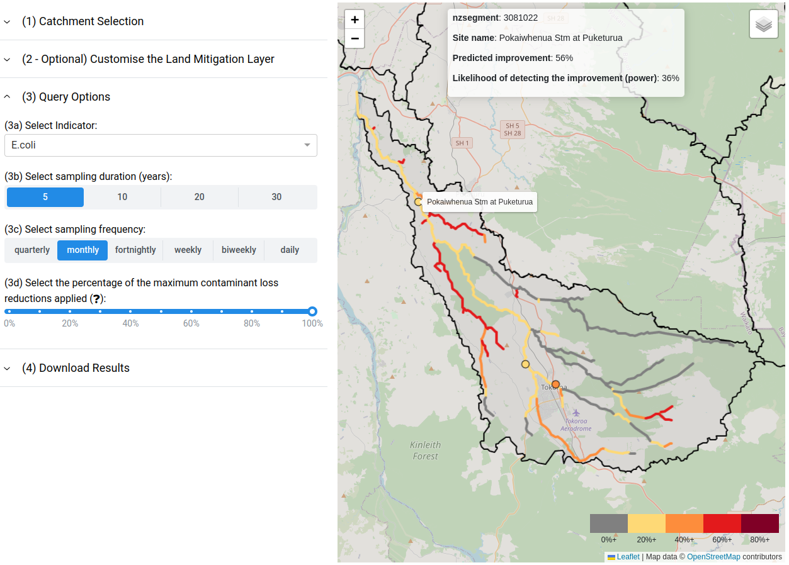

# Summary

The interactive web application provides guidance for designing a freshwater monitoring programme in New Zealand. In particular, the web application can be used to guide where, how often, and for how long a river, lake or groundwater site should be monitored to be able to reliably detect improvements in certain freshwater contaminants. The improvements can be targeted improvements, entered by the user, or predicted improvements modelled by the application based on upstream land mitigation actions. The design of the monitoring programme, such as the sampling frequency and duration, can be varied by the user to see how the detection power of the monitoring programme is affected. The application presents results in an interactive map, which allows the user to assess spatial variation (for example, across a catchment) in modelled freshwater improvements resulting from mitigation actions and in the detection power of a proposed monitoring regime. Further information about the methods used in the application and potential ways of implementing the application can be found in @McDowell_2024.
 
The software was developed in [Python](https://www.python.org/) using [Dash](https://dash.plotly.com/), can be run using [Docker](https://www.docker.com/), and can be deployed using [Docker Swarm](https://docs.docker.com/engine/swarm/). The code repository is stored on [GitHub](https://github.com/headwaters-hydrology/olw2-sc008). The deployed WebApp and supporting documentation (including a user guide) are available at [www.monitoringfreshwater.co.nz](https://www.monitoringfreshwater.co.nz).

# Statement of need

Land-based mitigation actions require considerable time and financial investment to reduce the loss of nutrients (nitrogen and phosphorus), sediment, and faecal bacteria from land into freshwater environments. Monitoring of freshwater environments is important to determine the effectiveness of mitigation actions. However, due to natural variability, changes in water quality and ecological indicators in a water body can be difficult to detect. Freshwater monitoring programmes should therefore be carefully designed to ensure they have adequate statistical power to be able to detect improvements in contaminant concentrations or ecological indicators. Good monitoring programme design can prevent years of wasted effort and expense.
 
Under current New Zealand legislation, regional authorities must set targets for various “attributes” in water bodies, such as nutrient concentrations and water clarity. Monitoring to evaluate progress towards achieving these targets is required; however, current monitoring frequencies vary from quarterly (e.g., in many lakes) to monthly in most rivers. This may not be frequent enough to detect improvements.
Based on these two related needs, the application has two main purposes:

1. Model the expected improvement in in-river and in-lake contaminant concentrations resulting from land-based mitigation actions in a catchment. These can be defined by the user or based on default settings.
2. Calculate the statistical power of a river, lake or groundwater monitoring regime to detect modelled (Step 1 above) or target (user-defined) improvements, either at a specified location or throughout a river network or lake. 

# Application components

## Land cover and associated land mitigation improvements

The reduction in the losses of each of the four main contaminants (nitrogen, phosphorus, sediment, and E.coli) from land is a necessary input dataset for modelling the improvements for in-river and in-lake contaminant loads (Step 1 above). Users can upload their own improvements layer for a catchment of interest, or utilise a default layer we have developed for all of New Zealand. We used the New Zealand Land Cover Database (LCDB) version 5 [@michelle_barnes_lcdb_2020] as a base layer, but edited it based on pastoral land use typologies [@McDowell_2021]. Each land cover or land type was associated with maximum “mitigatable” reductions in the loss of each contaminant (using information in [@McDowell_2021] for pastoral land use and other literature values for the other land cover types). Mitigatable reductions do not include contaminant concentrations expected under natural conditions [@McDowell_2013].

## Rivers

The rivers module contains six dashboards providing guidance on the likelihood of detecting changes in a range of key water quality and ecological indicators at existing monitoring sites and across the whole stream network of the selected catchment.

The land mitigation dashboard is dedicated to visualising the potential contaminant loss reductions from land parcels in a selected catchment. These reductions are then routed through the stream network to determine modelled in-river improvements which can be visualised. The “Water Quality-Catchment” dashboard uses the modelled land mitigation improvements described above (\autoref{webapp_example_fig}) and the “Water Quality-Monitoring Sites” dashboard allows the user to specify a target improvement for each monitoring site. In both modules, the user can then input various combinations of monitoring frequency and duration and the application calculates the likelihood of being able to detect the modelled or target in-river improvements.

A fourth dashboard allows the user to see stream reaches that have a high contribution of contaminant loads during high river flows (above the 90th percentile). This allows the user to evaluate the risk of poorly characterising annual contaminant loads if high-flow events are not captured by the monitoring programme.

The final two dashboards are for ecological parameters (a macroinvertebrate index, periphyton, and deposited sediment). In the first dashboard, the user defines a target improvement at each monitoring site and the application calculates the likelihood of being able to detect the target improvement based on the user-defined monitoring frequency and duration. In the other dashboard, the application provides qualitative guidance on where the user should monitor within a catchment based on where the greatest improvements in ecological indicators are likely to occur.

## Lakes

The lakes component encompasses two dashboards with four lake water quality attributes each. The first dashboard uses the land mitigation improvements layer for the lake’s catchment (as described above) and routes the contaminant improvements down the stream network to estimate the contaminant improvement at each lake. In the second dashboard, the user directly specifies a target improvement in one water quality attribute at existing monitoring sites. In both dashboards, the user then inputs the frequency and duration of the monitoring programme and the application calculates likelihood (power) of being able to detect the modelled or target improvement at the lake.

## Groundwater

The groundwater dashboard does not use the land mitigation improvements layer. Instead, the user inputs a percentage reduction in median nitrate-N concentration for all groundwater wells in a region. The user is then able to specify various combinations of the monitoring regime (frequency and duration). The application will then calculate the likelihood of the monitoring regime being able to detect that improvement for all wells in the region.

# References