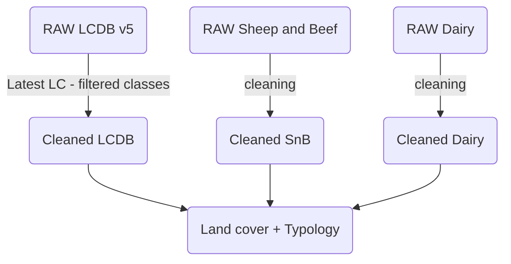

# Land Cover methods

## Purpose
The purpose of processing land cover is to develop a geospatial database of percent reductions in leaching by available chemical indicators on the land surface that would be routed downstream through a river network (specifically the REC v2.5). To accomplish this, we needed up-to-date spatial data with associated categories that relate relate leaching reductions to land areas.

## Input datasets
The most up-to-date spatial data for land cover for all of NZ is the Land Cover Database (LCDB) version 5.0 by Landcare Research. The most recent land cover assessment was for 2018. It includes 33 land cover categories. For our project, we only used 8 of these catgories as the others were either not relevant or very minor. 
These 8 categories are:

- Exotic Forest
- Forest - Harvested
- Orchard, Vineyard or Other Perennial Crop
- Short-rotation Cropland
- Built-up Area (settlement)
- High Producing Exotic Grassland
- Low Producing Grassland
- Mixed Exotic Shrubland

We obtained more recent reductions data for total nitrogen, total phosphorus, and suspended sediment for sheep/beef (SnB) and dairy land areas from the project [Quantifying contaminant losses to water from pastoral land uses in New Zealand III. What could be achieved by 2035?](https://doi.org/10.1080/00288233.2020.1844763). This data included much more detailed typologies (as compared to the LCDB) associated with the reductions. 

We also obtained general reduction estimates from Matt Highway for SnB, dairy, plantation forestry, and horticulture for nitrogen, phosphorus, sediment, and E.coli. These values were the basis for the assignment of reductions for the LCDB and the E.coli values everywhere.
He also updated the nitrogen and phosphorus values for two dairy typologies specifically for the Pokaiwhenua catchment. These are:

|Typology|Indicator|Reduction (%)|
|----- |-----|------|
|Warm/Low/Well/Moist|TN|39|
|Warm/Low/Well/Moist|TP|36|
|Cool/Low/Well/Moist|TN|32|
|Cool/Low/Well/Moist|TP|34|

## Land cover and typology processing
The LCDB was first filtered for areas with the above 8 categories in the 2018 year. The geometries were also cleaned and simplified to 1 meter for ease in the subsequent processing steps.

The SnB and dairy spatial data were processed in a similar way to ensure that the geometries were clean. 

The SnB and dairy data were graphed onto the LCDB; effectively replacing the spaitial areas in the LCDB with the SnB and dairy areas. 

#### Processing flowchart

#### The land cover categories and typologies reductions

| farm_type | typology                                    | land_cover                                | total phosphorus | total nitrogen | suspended sediment | e.coli |
| --------- | ------------------------------------------- | ----------------------------------------- | ---------------- | -------------- | ------------------ | ------ |
| SNB       | Finishing Breeding (Marlborough-Canterbury) | Sheep and Beef                            | 38               | 22             | 30                 | 35     |
| ARA       | Mixed Finishing (Marlborough-Canterbury)    | Sheep and Beef                            | 22               | 5              | 30                 | 35     |
| SNB       | High Country (Marlborough-Canterbury)       | Sheep and Beef                            | 16               | 11             | 30                 | 35     |
| SNB       | Hill Country (Marlborough-Canterbury)       | Sheep and Beef                            | 18               | 8              | 30                 | 35     |
| SHP       | Intensive Finishing (Otago/Southland)       | Sheep and Beef                            | 30               | 13             | 30                 | 35     |
| SNB       | Finishing Breeding (Otago/Southland)        | Sheep and Beef                            | 14               | 18             | 30                 | 35     |
| SNB       | Hill Country (Otago/Southland)              | Sheep and Beef                            | 15               | 13             | 30                 | 35     |
| SNB       | High Country (Otago/Southland)              | Sheep and Beef                            | 24               | 3              | 30                 | 35     |
| SHP       | Intensive Finishing (East Coast)            | Sheep and Beef                            | 27               | 21             | 30                 | 35     |
| SNB       | Hard Hill Country (Taranaki-Manawatu)       | Sheep and Beef                            | 46               | 18             | 30                 | 35     |
| BEF       | Intensive Finishing (Taranaki-Manawatu)     | Sheep and Beef                            | 23               | 29             | 30                 | 35     |
| SNB       | Hill Country (Taranaki-Manawatu)            | Sheep and Beef                            | 33               | 15             | 30                 | 35     |
| SNB       | Hill Country (East Coast)                   | Sheep and Beef                            | 34               | 14             | 30                 | 35     |
| SHP       | Hard Hill Country (East Coast)              | Sheep and Beef                            | 52               | 24             | 30                 | 35     |
| BEF       | Hill Country (Northland-Waikato-BoP)        | Sheep and Beef                            | 40               | 22             | 30                 | 35     |
| BEF       | Intensive Finishing (Northland-Waikato-BoP) | Sheep and Beef                            | 32               | 26             | 30                 | 35     |
| GRA       | Hard Hill Country (Northland-Waikato-BoP)   | Sheep and Beef                            | 57               | 30             | 30                 | 35     |
| DAI       | Cool/Low/Light/Irrigated                    | Dairy                                     | 39               | 55             | 65                 | 75     |
| DAI       | Cool/Low/Well/Dry                           | Dairy                                     | 45               | 57             | 65                 | 75     |
| DAI       | Cool/Low/Light/Dry                          | Dairy                                     | 42               | 44             | 65                 | 75     |
| DAI       | Cool/Low/Poor/Irrigated                     | Dairy                                     | 53               | 74             | 65                 | 75     |
| DAI       | Cool/Low/Well/Irrigated                     | Dairy                                     | 70               | 85             | 65                 | 75     |
| DAI       | Cool/Low/Well/Moist                         | Dairy                                     | 40               | 41             | 65                 | 75     |
| DAI       | Cool/Low/Light/Moist                        | Dairy                                     | 39               | 52             | 65                 | 75     |
| DAI       | Cool/Low/Poor/Dry                           | Dairy                                     | 45               | 66             | 65                 | 75     |
| DAI       | Warm/Low/Light/Irrigated                    | Dairy                                     | 48               | 47             | 65                 | 75     |
| DAI       | Cool/Moderate/Poor/Dry                      | Dairy                                     | 38               | 65             | 65                 | 75     |
| DAI       | Cool/High/Poor/Moist                        | Dairy                                     | 40               | 61             | 65                 | 75     |
| DAI       | Cool/High/Poor/Dry                          | Dairy                                     | 45               | 66             | 65                 | 75     |
| DAI       | Cool/High/Well/Dry                          | Dairy                                     | 45               | 57             | 65                 | 75     |
| DAI       | Cool/Low/Well/Wet                           | Dairy                                     | 39               | 44             | 65                 | 75     |
| DAI       | Cool/Low/Poor/Wet                           | Dairy                                     | 48               | 61             | 65                 | 75     |
| DAI       | Warm/Low/Poor/Wet                           | Dairy                                     | 62               | 77             | 65                 | 75     |
| DAI       | Warm/Low/Well/Wet                           | Dairy                                     | 40               | 52             | 65                 | 75     |
| DAI       | Cool/Low/Light/Wet                          | Dairy                                     | 47               | 52             | 65                 | 75     |
| DAI       | Warm/Moderate/Well/Wet                      | Dairy                                     | 46               | 49             | 65                 | 75     |
| DAI       | Cool/Moderate/Light/Dry                     | Dairy                                     | 35               | 59             | 65                 | 75     |
| DAI       | Cool/Moderate/Well/Dry                      | Dairy                                     | 38               | 64             | 65                 | 75     |
| DAI       | Warm/Low/Well/Dry                           | Dairy                                     | 39               | 58             | 65                 | 75     |
| DAI       | Warm/Low/Light/Dry                          | Dairy                                     | 41               | 36             | 65                 | 75     |
| DAI       | Warm/Low/Poor/Dry                           | Dairy                                     | 36               | 73             | 65                 | 75     |
| DAI       | Warm/High/Well/Dry                          | Dairy                                     | 39               | 58             | 65                 | 75     |
| DAI       | Cool/Low/Poor/Moist                         | Dairy                                     | 40               | 64             | 65                 | 75     |
| DAI       | Cool/High/Well/Wet                          | Dairy                                     | 39               | 48             | 65                 | 75     |
| DAI       | Cool/High/Well/Moist                        | Dairy                                     | 40               | 48             | 65                 | 75     |
| DAI       | Warm/Low/Well/Irrigated                     | Dairy                                     | 56               | 79             | 65                 | 75     |
| DAI       | Warm/Low/Poor/Irrigated                     | Dairy                                     | 53               | 74             | 65                 | 75     |
| DAI       | Warm/Low/Well/Moist                         | Dairy                                     | 50               | 52             | 65                 | 75     |
| DAI       | Cool/Moderate/Well/Moist                    | Dairy                                     | 46               | 50             | 65                 | 75     |
| DAI       | Warm/Low/Light/Moist                        | Dairy                                     | 51               | 50             | 65                 | 75     |
| DAI       | Warm/Low/Poor/Moist                         | Dairy                                     | 62               | 65             | 65                 | 75     |
| DAI       | Cool/Moderate/Well/Wet                      | Dairy                                     | 46               | 55             | 65                 | 75     |
| DAI       | Cool/Moderate/Light/Irrigated               | Dairy                                     | 41               | 62             | 65                 | 75     |
| DAI       | Cool/Moderate/Well/Irrigated                | Dairy                                     | 52               | 79             | 65                 | 75     |
| DAI       | Warm/Low/Light/Wet                          | Dairy                                     | 63               | 51             | 65                 | 75     |
| DAI       | Warm/Moderate/Light/Moist                   | Dairy                                     | 51               | 46             | 65                 | 75     |
| DAI       | Warm/Moderate/Poor/Moist                    | Dairy                                     | 42               | 44             | 65                 | 75     |
| DAI       | Warm/High/Light/Wet                         | Dairy                                     | 63               | 51             | 65                 | 75     |
| DAI       | Warm/Moderate/Light/Wet                     | Dairy                                     | 60               | 47             | 65                 | 75     |
| DAI       | Warm/Moderate/Poor/Wet                      | Dairy                                     | 54               | 47             | 65                 | 75     |
| DAI       | Warm/Moderate/Well/Moist                    | Dairy                                     | 58               | 51             | 65                 | 75     |
| DAI       | Warm/High/Well/Moist                        | Dairy                                     | 50               | 52             | 65                 | 75     |
| DAI       | Cool/Moderate/Poor/Wet                      | Dairy                                     | 50               | 45             | 65                 | 75     |
| DAI       | Cool/Moderate/Light/Wet                     | Dairy                                     | 51               | 52             | 65                 | 75     |
| DAI       | Warm/High/Light/Moist                       | Dairy                                     | 51               | 50             | 65                 | 75     |
| DAI       | Warm/High/Well/Wet                          | Dairy                                     | 44               | 52             | 65                 | 75     |
| DAI       | Cool/High/Light/Moist                       | Dairy                                     | 39               | 52             | 65                 | 75     |
| DAI       | Warm/Moderate/Poor/Dry                      | Dairy                                     | 35               | 61             | 65                 | 75     |
| DAI       | Cool/Moderate/Poor/Moist                    | Dairy                                     | 45               | 45             | 65                 | 75     |
| DAI       | Cool/Moderate/Light/Moist                   | Dairy                                     | 46               | 52             | 65                 | 75     |
| DAI       | Warm/Moderate/Light/Dry                     | Dairy                                     | 40               | 47             | 65                 | 75     |
| DAI       | Warm/Moderate/Well/Dry                      | Dairy                                     | 39               | 61             | 65                 | 75     |
| DAI       | Cool/High/Light/Dry                         | Dairy                                     | 42               | 44             | 65                 | 75     |
| DAI       | Warm/High/Poor/Moist                        | Dairy                                     | 47               | 65             | 65                 | 75     |
| DAI       | Cool/High/Light/Wet                         | Dairy                                     | 47               | 52             | 65                 | 75     |
| DAI       | Warm/High/Light/Dry                         | Dairy                                     | 41               | 36             | 65                 | 75     |
| DAI       | Warm/Moderate/Light/Irrigated               | Dairy                                     | 48               | 50             | 65                 | 75     |
| DAI       | Warm/High/Poor/Dry                          | Dairy                                     | 36               | 66             | 65                 | 75     |
| NA        | Built-up Area (settlement)                  | Built-up Area (settlement)                | 0                | 0              | 0                  | 0      |
| NA        | Low Producing Grassland                     | Low Producing Grassland                   | 31               | 17             | 30                 | 35     |
| NA        | High Producing Exotic Grassland             | High Producing Exotic Grassland           | 46               | 56             | 65                 | 75     |
| NA        | Exotic Forest                               | Exotic Forest                             | 30               | 0              | 30                 | 0      |
| NA        | Orchard, Vineyard or Other Perennial Crop   | Orchard, Vineyard or Other Perennial Crop | 50               | 15             | 50                 | 0      |
| NA        | Mixed Exotic Shrubland                      | Mixed Exotic Shrubland                    | 0                | 0              | 0                  | 0      |
| NA        | Forest - Harvested                          | Forest - Harvested                        | 30               | 0              | 30                 | 0      |
| NA        | Short-rotation Cropland                     | Short-rotation Cropland                   | 50               | 30             | 50                 | 30     |