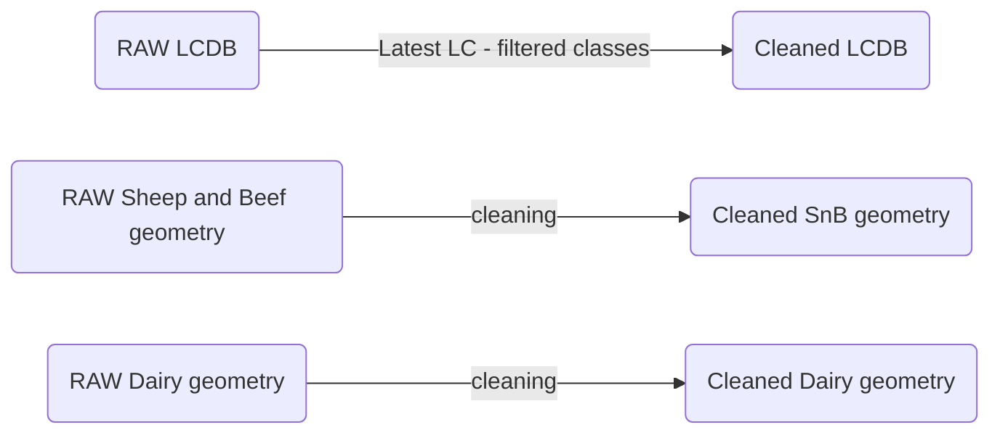

# Land Cover methods

### Land cover geometry processing

```mermaid
flowchart LR
    lcdb1(RAW LCDB) -->|Latest LC - filtered classes| lcdb2(Cleaned LCDB)
    snb1(RAW Sheep and Beef geometry) --> |cleaning| snb2(Cleaned SnB geometry)
    dairy1(RAW Dairy geometry) --> |cleaning| dairy2(Cleaned Dairy geometry)

```

### Land cover typology reductions processing

```mermaid
flowchart LR
    lcdb1(RAW LCDB) -->|Latest LC - filtered classes| lcdb2(Cleaned LCDB)
    snb1(RAW Sheep and Beef geometry) --> |cleaning| snb2(Cleaned SnB geometry)
    dairy1(RAW Dairy geometry) --> |cleaning| dairy2(Cleaned Dairy geometry)

```

